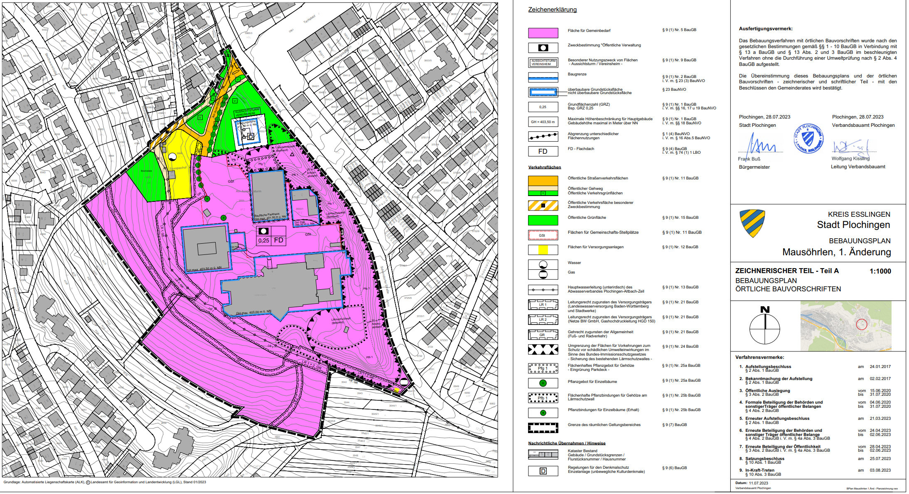

# Aufgabe 5 

 

## 🗺 + 🖊 Bebauungspläne georeferenzieren und Geltungsbereiche erfassen

 

### 🎯 Ziel der Einheit:
Mit dieser Übung verfolgen wir den klassischen Prozess eines Bebauungsplans (BPlan). Er wird von einer Gemeinde an das Landratsamt übergeben und vom GIS-Team digital aufberei-tet, um der Öffentlichkeit sowie Entscheidungsträgerinnen und -trägern zur Verfügung zu ste-hen.

 

### Lerninhalte:
-	Einen WMS-Layer hinzufügen
-	🗺 Georeferenzieren mit ArcGIS Pro
-	✂ Einen Kartenrand entfernen / Raster zuschneiden
-	🖊 Den Geltungsbereich digitalisieren

 

### 🕗 Dauer:
~ 60 bis 120 min

 

## Abbildung des Bebauungsplans (kurz BPlan)

